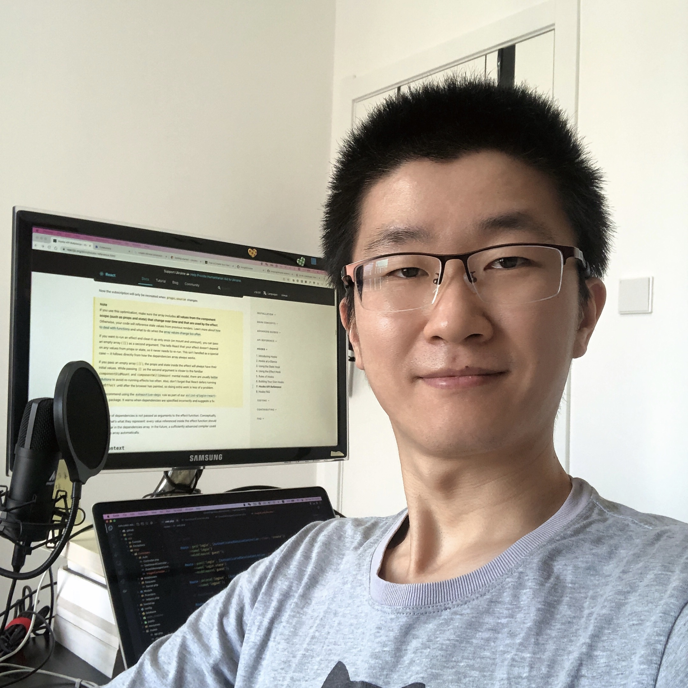

# 7 年 web 前端开发-温柔的码农Bond-求带走

> 也发到了[电鸭社区](https://eleduck.com/), 作为[新人露脸帖](https://eleduck.com/posts/OGfrGz). \
> 你也可查看我的简历 [中文版](cv-zh.md) | [英文版](cv-en.md), 确定想登录进案例时给我发消息我给你帐号密码, 但许多时候我并不设计页面, 我只是写代码, 哈哈哈~

你好鸭, 我是温柔的码农Bond, 男, 33 了今年(2022). 大学是在西安外国语大学读的英语专业, 英语专八. 毕业后就自学了 web 前端技能, 在西安做了 7 年前端开发, 现在定居在了陕西宝鸡.

## 我擅长

- 使用 React/Vue/Angular/RxJS/PHP/Laravel 开发高性能, 高可维护的网站;
- 使用 Taro 框架开发健壮的微信小程序;
- 使用 Ionic Framework/React Native 开发高性能的 iOS 和 Android 应用.

## 三家公司工作经历

这第一家小公司, 就是在人最多时连老板一起好像 5 人. 主要在写公司自己的 web 项目, 也在做一些外包项目. 老板是美籍华人, 工作交流基本是英语. 他主要在写 Ruby/Python, 我们在写前端和 后端 PHP/Zend Framework 1. 我还在用 Cordova 写移动端 app, 用 Compound.js 写一个后端项目. 前端当时是 JS/jQuery/AngularJS/Underscore + Backbone, 蛤蛤蛤, 没想到最后就只用一回 AngularJS, 好可惜. 用 CasperJS/Protractor/PHPUnit 做测试. 期间我软磨硬泡说服老板把仓库从 SVN 转到 Git上来了, SVN 太慢了, 每次看个记录要等好久. 我还斥巨资买了 13 寸的 MacBook Air. 而老板竟然在用一个顶配版的 11 寸 MacBook Air, 他好像经常出差.

第二家公司是一家初创型小外包公司(蓝石创想). 这就有意思了, 入职后看到同事在用的 MacBook Pro 那屏幕, 那性能, 我又斥巨资买了 15 寸了 MacBook Pro. 小公司, 我跟老板一起面试招人, 一起去北京谈需求, 一起写代码, 一起去厦门去农家乐, 一起去桌游, 去逛去吃去撒野. 在这里主要是写 Angular 和 Laravel 项目, 都是老板从北京找来的项目. 用 Angular 主要是项目表单多, 后端 PHP 框架我们对比了 Laravel/Phalcon/Yaf/Yii/CodeIgniter/Zend Framework 2 等发现还是 Laravel 功能多, 好用好写, 生态也大, 就定下来用这个, 所有后端项目好像都用的这个. 期间开发过网站, 网站后台, 有个后台有生成 PDF 的, 我用 PrinceXML 做的渲染. 也有个项目用的 pjax 技术, 传输的只有一小段 HTML, 连数据库也查得少, 用起来人还以前端用了啥框架哈哈哈. 还用 Ionic Framework 写了一个移动端 app, 那时候 Ionic Framework 只有 Angular 一种写法. 我这家公司有一种合伙人的感觉. 现在回想起来在这家公司回忆最多.

第三家公司是个大公司(龙途互动). 100来号人. 入职后我一看, 职业竟然叫 "高级前端开发", 哈哈哈, 我面试当然都是写 web 前端开发, 这回我 "高级" 了. 果然, 难度就上来了, 一入职 CEO 亲自给我安排了一个富文本编辑器的项目. 这难度一下就上来了. 我不慌, 基于 CKEditor 继续开发, 期间还把 CKFinder 也加进来管理图片视频. 前端上 Angular + NG ZORRO, 后端当然是 Laravel 了. 从数据库设计, 假数据, 数据库迁移, RBAC 权限系统, 再到所有前后端功能, 我都是独自一人完成, 甚至还给运维准备了 Nginx 配置示例. 完后就开始写 React/Vue/jQuery 项目了, 移动端 PC 端前端. 还有一个任务是在一个 Laravel 项目里处理一堆数据输出到前端, 然后用 ECharts 画个蒲公英图. 再后来就用 WePY/mpvue/Taro 写微信小程序. 老项目都是 WePY, 在上面改, 新项目当时看着 mpvue 可以就用起来了, 没想到项目没做完 mpvue 就停止了维护(瑟瑟发抖, 框架是我选的). 后来的小程序新项目在对比了一堆框架后, 决定用 Taro 的, 感觉这个可以走更远. 用 Taro 写了一个实时答题比赛的项目, 用 WebSocket 跟后端交互, 我超喜欢这个项目, 因为大赛数据是实时的, 可以看到用户激烈的竞赛过程, 能看到用户在用我写的东西真是一件开心的事啊. 用户在比赛时随时可能断网/关闭小程序/切换到后台啥的, 我都要考虑, 用户再热启动冷启动回来我就要恢复现场, 而我最擅长这种恢复现场的方方面面, 要非常小心才可以避免 bug, 哈哈哈, 太狂了太狂了~. 还为另一个客户也做了一个更复杂的, 有团队赛. 公司主要有个直播类的项目. 我参与做了一些 WebRTC 的功能, 用浏览器通过摄像头录视频, 录电脑画面, 合并, 上传, 也用到了腾讯的 TRTC, 发现腾讯这个 TRTC 可真是方便啊. 我还独立写了一个视频的导播台(没用上, 笑~). 还用 React Native 写了一个移动端 app, 有安卓版和 iOS 版, 那时还是 Redux 样板代码流行的时候, 我用了全套样板代码, 哈哈哈, 太多了, 再让我写我一定按功能划分. 到那些不是 Laravel 的项目我都会自己加一个类似 Laravel 视图里的 mix() 一样的函数来清除缓存. 有的项目太老了, 我就用 Webpack 新搭建前端自动化工具, 要解决打包位置的问题, 视图文件合并的问题, 还有 Vue 等代码的编译问题, 语法还不能跟后端 PHP 框架的视图语法冲突, 编译还不能慢.

再后来就来到了宝鸡住下. 开始接外包, 老东家还给派了活, 一个微信里的 web app. 上了最新的 Vite + Vue 3 + Pinia + RxJS, 为啥没用 Axios? 我用的 RxJS 里的 Ajax 呀哈哈哈~. 由于是向老项目里加的, 我也写了个模拟 Laravel 视图里的 mix() 的辅助函数以清除缓存. 用 html2canvas 生成截图, 用 animate.css 加动画. 为啥要写这么细? 因为没别的高大上的东西可写了呀哈哈哈~

我发现接外包项目不好找, 我估不好时间, 谈不好价格, 客户加需求我也不好意思说不, 而客户大部分是基本没多少预算的状态, 价格一降再降客户都嫌多. 还是找个公司直接远程入职工作吧. 坐等公司收我了~

其它技能还是要继续学习的, 比如 Django/Rails/Spring Boot, 想当年第一家公司时还写一个 Java 项目里的 Groovy 呢, 那时还用着 Gradle 打包呢, 打包一次等半天, 现在跟傅立叶一起忘光光了~

上传一张美颜后的照片吧~ 哈哈哈~

